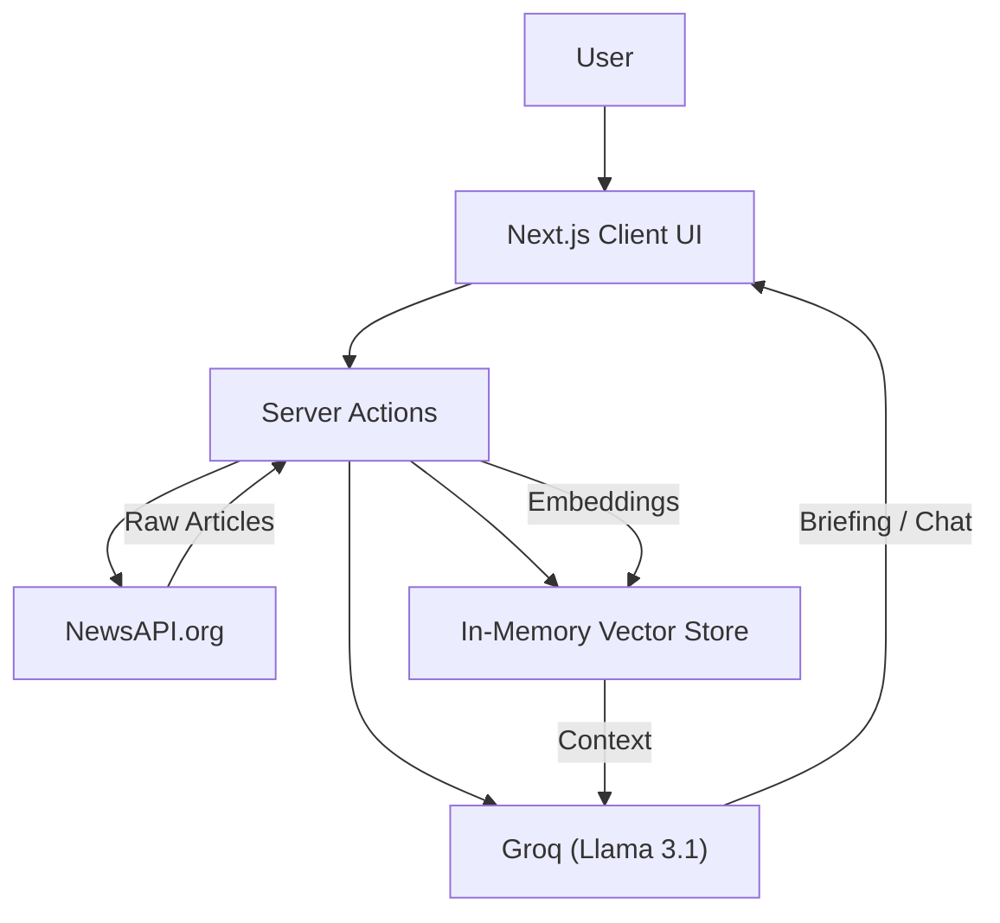

# NewsGraph AI 🧠📰


**NewsGraph AI** is a state-of-the-art news intelligence platform designed to transform information overload into actionable insights. By fusing real-time global news aggregation with **Retrieval-Augmented Generation (RAG)** and an interactive **Knowledge Graph**, it offers a depth of context that traditional news readers cannot match.

> **"Navigate the noise. Understand the signal."**

---

## 🌟 Why NewsGraph AI?

In the age of information abundance, the challenge isn't finding news—it's understanding it. NewsGraph AI solves this by:
1.  **Synthesizing, not just summarizing**: Our "Personal Editor" agent reads multiple sources to give you a strategic briefing.
2.  **Visualizing connections**: The Knowledge Graph reveals how a single story ripples across different topics and entities.
3.  **Enabling dialogue**: Don't just read; ask questions. The "Ask AI" feature lets you interrogate the text for specific answers.

---

## ✨ Key Features

### 🔍 Deep Dive Context & Knowledge Graph
Clicking any news card opens the **Deep Dive Sidebar**, a power-user interface containing:
*   **Interactive Graph**: A force-directed graph visualization showing related entities and articles.
*   **Contextual Chat**: A dedicated AI assistant that has "read" the specific article and its related context. You can ask:
    *   *"What is the background of this conflict?"*
    *   *"Who are the key political figures involved?"*
    *   *"Summarize the financial impact."*

### 🤖 Personal Editor (Agentic Briefing)
A "Commercial-Grade" intelligence agent that generates executive briefings on *any* topic.
*   **Live Research**: It actively queries the NewsAPI for the latest articles on your requested topic.
*   **Structured Output**: Generates a Markdown report with:
    *   **🎯 Executive Summary**: High-level strategic overview.
    *   **🔑 Key Developments**: Bulleted list of critical facts and dates.
    *   **🧠 Strategic Context**: Analysis of drivers and geopolitical forces.
    *   **🔮 Future Implications**: Short-term and long-term forecasts.
*   **Visual Process**: Watch the agent "Scan Global Network", "Extract Entities", and "Synthesize Report" in real-time.

### 🎨 Premium UI/UX
*   **Adaptive Theming**: Seamlessly switches between a data-rich **Dark Mode** (Zinc/Black) and a clean **Light Mode** (White/Gray).
*   **Spotlight Effect**: Custom cursor-following radial gradients on cards for a tactile, premium feel.
*   **Glassmorphism**: Modern, translucent UI elements with background blurring.
*   **Micro-interactions**: Smooth Framer Motion animations for entry, hover, and click states.

---

## 🏗️ Architecture

NewsGraph AI is built on a modern, scalable stack:



*   **Frontend**: Next.js 15 (App Router) with React 19.
*   **Styling**: Tailwind CSS v4 (using the new engine) + Framer Motion.
*   **AI Orchestration**: LangChain.js.
*   **LLM Provider**: Groq (running Llama 3.1 8B Instant for sub-second latency).
*   **Vector Search**: In-memory vector store (for demo simplicity) using cosine similarity.

---

## 📂 Project Structure

```bash
newsgraph-ai/
├── app/
│   ├── actions.ts         # Server Actions (LLM calls, API fetches)
│   ├── client-page.tsx    # Main client-side UI orchestrator
│   ├── globals.css        # Tailwind v4 configuration & themes
│   ├── layout.tsx         # Root layout & ThemeProvider
│   └── page.tsx           # Server-side data fetching entry point
├── components/
│   ├── DeepDiveSidebar.tsx # Sidebar with Chat & Graph
│   ├── GraphView.tsx       # Interactive Knowledge Graph
│   ├── NewsCard.tsx        # Spotlight-enabled article card
│   ├── NewsFeed.tsx        # Grid layout for cards
│   ├── PersonalBriefing.tsx # Agentic Editor UI
│   ├── Spotlight.tsx       # Reusable UI effect component
│   ├── ThemeProvider.tsx   # Next-themes wrapper
│   └── ThemeToggle.tsx     # Light/Dark mode switch
├── lib/
│   ├── news-service.ts    # NewsAPI integration
│   └── rag-engine.ts      # Vector store & RAG logic
└── public/                # Static assets
```

---

## 🚀 Getting Started

### Prerequisites

*   **Node.js** 18.17 or later
*   **npm** or **yarn**
*   **NewsAPI Key**: Get one free at [newsapi.org](https://newsapi.org/).
*   **Groq API Key**: Get one free at [console.groq.com](https://console.groq.com/).

### Installation

1.  **Clone the repository**
    ```bash
    git clone https://github.com/yourusername/newsgraph-ai.git
    cd newsgraph-ai
    ```

2.  **Install dependencies**
    ```bash
    npm install
    ```

3.  **Configure Environment**
    Create a `.env.local` file in the root directory:
    ```bash
    cp .env.example .env.local
    ```
    
    Fill in your keys:
    ```env
    # Required for fetching news
    NEXT_PUBLIC_NEWS_API_KEY=your_newsapi_key_here
    
    # Required for AI features
    GROQ_API_KEY=your_groq_key_here
    ```

4.  **Run Development Server**
    ```bash
    npm run dev
    ```

5.  **Launch**: Open [http://localhost:3000](http://localhost:3000) to see the app.

---

## ⚙️ Configuration & Customization

### Changing the LLM Model
Navigate to `app/actions.ts`. You can switch the Groq model string to any supported model (e.g., `mixtral-8x7b-32768`):

```typescript
const chat = new ChatGroq({
    apiKey: process.env.GROQ_API_KEY,
    model: "llama-3.1-8b-instant", // Change this
    temperature: 0.5,
});
```

### Modifying the Theme
Tailwind v4 is configured in `app/globals.css`. You can adjust the CSS variables for light/dark modes:

```css
.dark {
  --background: #0a0a0a;
  --foreground: #ededed;
}
```

---

## 🗺️ Roadmap

*   [ ] **Persistent Vector Store**: Move from in-memory to Supabase/Pinecone for long-term memory.
*   [ ] **User Accounts**: Save briefings and favorite articles.
*   [ ] **Multi-Model Support**: Allow users to switch between GPT-4, Claude, and Llama.
*   [ ] **Export to PDF**: Download briefings as professional PDF reports.
*   [ ] **Voice Interface**: Listen to your daily briefing.

---

## 🤝 Contributing

Contributions are welcome! Please feel free to submit a Pull Request.

1.  Fork the project
2.  Create your feature branch (`git checkout -b feature/AmazingFeature`)
3.  Commit your changes (`git commit -m 'Add some AmazingFeature'`)
4.  Push to the branch (`git push origin feature/AmazingFeature`)
5.  Open a Pull Request

---

## 📄 License

This project is licensed under the MIT License - see the [LICENSE](LICENSE) file for details.

---
